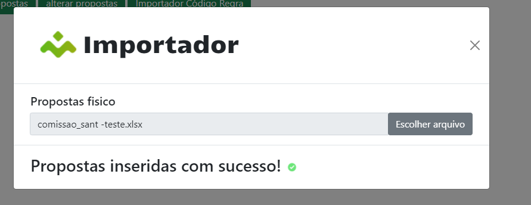

#Importadores GMVB

#### Informações Gerais

- Serão aceitos somente arquivos .xlsx
- Importante usar os aquivos atrelados a documentação, pois a aplicação usa os parâmetros prédefinidos no cabeçalho para fazer consultas no banco de dados.
Cabeçalhos com espaço ou com nomes diferentes resultam em erro da aplicação.

#### Uso 
###### Caso 1:
Todas as propostas inseridas/Alteradas com sucesso:

###### Caso 2:
Algumas propostas com erro:

clicando em "veja mais"
 podera ver propostas e motivo do erro:

[TOCM]

[TOC]

#H1 header
##H2 header
###H3 header
####H4 header
#####H5 header
######H6 header
#Heading 1 link [Heading link](https://github.com/pandao/editor.md "Heading link")
